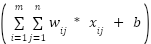
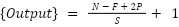
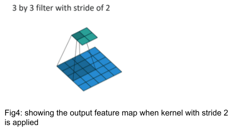
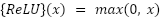
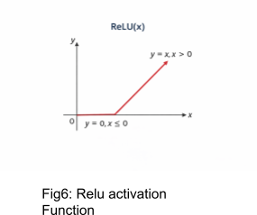
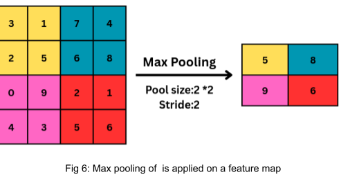
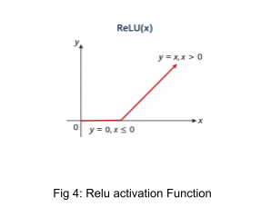

## Theory

### I. Motivation for Convolutional Neural Networks

Fully connected networks aren't ideal for images because flattening destroys spatial relationships between nearby pixels, and the dense connections create too many parameters, making them costly and prone to overfitting. CNNs solve this by using local connectivity and shared weights, which preserve spatial patterns and make learning more efficient and effective for visual data.

### II. Digital Images as Inputs to CNNs

A digital image can be represented as a 3D array with height, width, and channels. For color images, the three channels correspond to RGB intensity values. For example, CIFAR-10 images are 32 × 32 pixels with three channels, giving an input tensor of shape 32 × 32 × 3. CNNs take this multi-dimensional input directly, preserving spatial and channel-wise information during processing.

### III. Neurons in the Convolutional Layer

There are neurons in convolution layers. Each neuron is connected only to a local region (receptive field) of the input, computes a weighted sum + bias, applies an activation function, and contributes to one element in a feature map.


**Key Concepts:**

- **Left:** The input image of size 5 × 5 is shown. The red box represents the receptive field, i.e., a local 3 × 3 region of the image.
- **Middle:** A 3 × 3 filter (kernel) is applied to this local patch using element-wise multiplication and summation.
- **Right:** A single neuron output (one scalar value) is obtained, which forms one element of the feature map.
- **Key idea:** Each neuron in a convolutional layer is connected only to a local region of the input, not the entire image. This is known as local connectivity.

### IV. Convolution Operation

Convolution slides a small filter over the image and computes weighted sums to capture local features, such as edges and textures. Reusing the same filter across the image reduces parameters while keeping strong feature learning.



Mathematically, the convolution operation is performed where **I** is the input image and **K** is the kernel.

**Understanding Convolution:**

- The convolution operation is performed by the kernel on an input image matrix to calculate a feature map.


- For RGB images with 3 channels, convolution operates across all channels simultaneously.


### V. Feature Maps and Hierarchical Feature Learning

After convolution, the output is a feature map. Each filter detects a specific feature, and combining multiple filters produces multiple feature maps. As layers go deeper, simple features (like edges) combine into complex ones (shapes and parts), letting CNNs learn useful patterns automatically without manual feature design.

### VI. Stride and Padding

**Stride** is how many pixels the filter shifts each step; a larger stride reduces the output size. **Padding** adds (usually zero) pixels around the input to control output dimensions and keep edge information.

**Output Size Formula:**



Output = `(N - F + 2P) / S + 1`

Where:
- **N** = input size
- **F** = filter size
- **P** = padding
- **S** = stride

**Examples:**

- With kernel size 3×3 and stride 2, output size reduces significantly:




- With padding=1, output size can be preserved: Output = `(N - F + 2) / S + 1`

### VII. Activation Functions in CNNs

After convolution, an activation function adds non-linearity. The most common is **ReLU** (Rectified Linear Unit):



`f(x) = max(0, x)`, which helps reduce vanishing gradients and speeds up training.



ReLU transforms the filter output by setting all negative values to zero while preserving positive values, introducing non-linearity essential for learning complex patterns.


### VIII. Pooling Layers

Pooling downsamples feature maps to reduce computation and make features more robust to small shifts. Common types are max pooling, average pooling, and global average pooling, and they can also help reduce overfitting.

#### Max Pooling

Max pooling is a pooling operation that selects the maximum element from the region of the feature map covered by the filter. Thus, the output after max-pooling layer would be a feature map containing the most prominent features of the previous feature map.


#### Average Pooling

Average pooling computes the average of the elements present in the region of the feature map covered by the filter. Thus, while max pooling gives the most prominent feature in a particular patch of the feature map, average pooling gives the average of features present in a patch.



### IX. Flattening

Before entering the fully connected layer, the feature maps from the previous convolutional and pooling layers are typically flattened into a one-dimensional vector. This is done to convert the spatial information into a format suitable for fully connected layers.



### X. Overall CNN Architecture

A typical CNN stacks convolution, activation, and pooling layers to extract features, then uses fully connected layers or global pooling as a classifier. This pipeline enables strong image recognition performance with efficient use of parameters.

**Typical Architecture Flow:**

```
Input Image → [Conv → Activation → Pooling]×N → Flatten → Fully Connected → Output
```


### Merits of Convolutional Neural Networks

- Efficient parameter sharing (fewer weights than fully connected networks)
- Preserves spatial structure in images
- Automatically learns and extracts features
- Strong generalization on image data
- Scalable to large and complex visual tasks
- Backbone of modern computer vision systems

### Demerits of Convolutional Neural Networks

- Require high computational resources (GPU/TPU)
- Need large labeled datasets for best performance
- Training deep CNNs can be time-consuming
- Features learned are hard to interpret (low explainability)