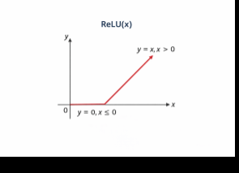
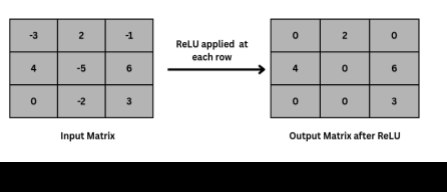
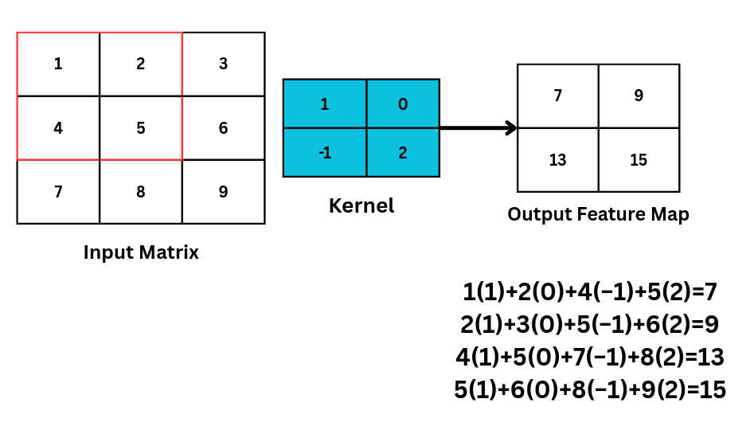
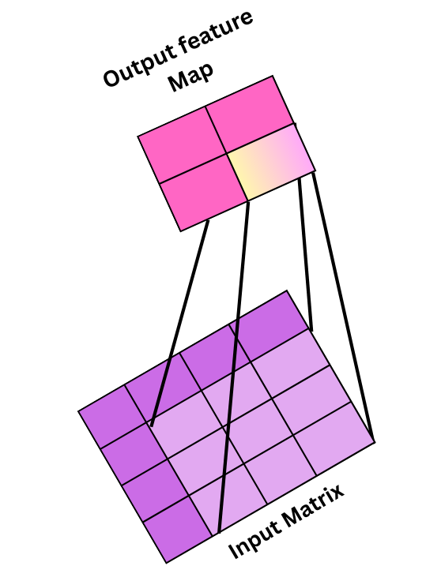
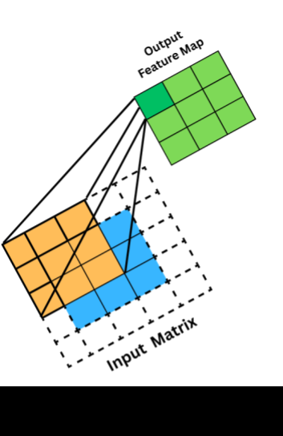
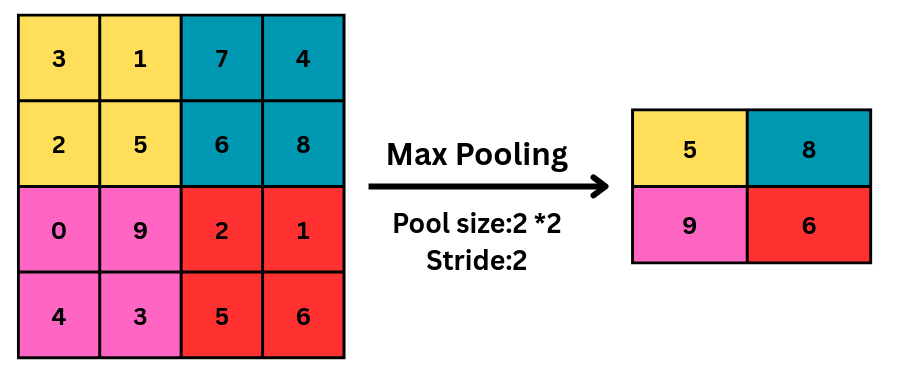
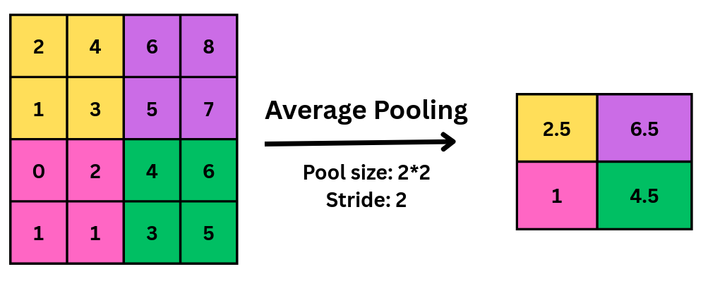
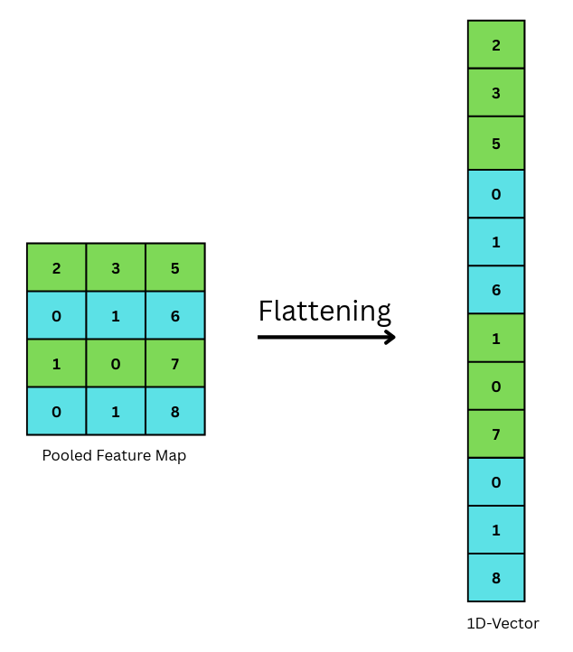
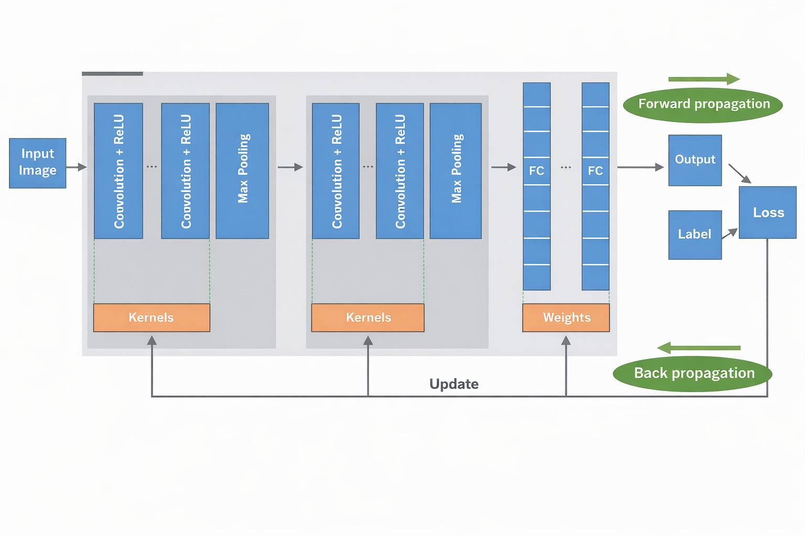

### Theory

**I. Motivation for Convolutional Neural Networks**

Fully connected networks aren't ideal for images because flattening destroys spatial relationships between nearby pixels, and the dense connections create too many parameters, making them costly and prone to overfitting. CNNs solve this by using local connectivity and shared weights, which preserve spatial patterns and make learning more efficient and effective for visual data.

**II. Digital Images as Inputs to CNNs**

A digital image can be represented as a 3D array (Tensor) with Height, Width, and Channels. For color images, the three channels correspond to RGB intensity values. For example, CIFAR-10 images are 32 × 32 pixels with three channels, giving an input tensor of shape 32 × 32 × 3. CNNs take this multi-dimensional input directly, preserving spatial and channel-wise information during processing.

**III. Revised Data Normalization**

Raw pixel values range from 0 to 255. Before training, we scale these values using a specific Mean and Standard Deviation (e.g., Mean: 0.4914, Std: 0.2470 for CIFAR-10). It scales input features to a similar range, which ensures gradient stability and allows the model to converge (learn) faster.

**IV. Revised Neurons in the Convolutional Layer**

**Local Connectivity:** Unlike standard neurons that try to look at an entire image at once, a CNN neuron focuses only on a small, specific window of the image called the receptive field. This "local connectivity" ensures the network can focus on small details rather than getting overwhelmed by the whole picture.

**Calculate Weighted Sum & Bias:** Inside this small window, the neuron performs a simple mathematical operation. It takes the pixel values in that area and multiplies them by its own learned weights (stored in a filter or kernel). It adds these results together along with a bias to produce a single numerical value. This value represents how strongly a specific feature, like a vertical edge, is present in that spot.

**Activation & Feature Creation:** Finally, this value is passed through an activation function (like ReLU) to introduce non-linearity, allowing the network to learn more complex patterns. The resulting number becomes one single "pixel" or element in a new grid called a feature map. Below is the equation to calculate the output of a single neuron within a convolutional layer.

$$Y = f\left(\sum_{i=1}^{m}\sum_{j=1}^{n} w_{ij}\, x_{ij} + b\right)$$

Where: $i, j = 1, 2, 3, 4, 5\ldots$

*   $x_{ij}$ = input pixel in receptive field
*   $w_{ij}$ = filter weight
*   $b$ = bias
*   $f(\cdot)$ = activation function (ReLU, sigmoid, etc.)

**V. Activation Functions in CNNs**

ReLU (Rectified Linear Unit): Applied after convolution, defined as $f(x) = \max(0, x)$ as shown in Fig 1.

*Fig 1: Relu activation Function*

Refer Figure 2 shown below to understand how the Relu function affects the filter output.

*Fig 2: showing how relu affects the filter output*

**VI. Convolution Operation**

Convolution slides a small filter over the image and computes weighted sums to capture local features, such as edges and textures. Reusing the same filter across the image reduces parameters while keeping strong feature learning.

Mathematically, the convolution operation can be expressed as the above equation where $I$ is the input image and $K$ is the kernel.

$$(I * K)(x, y) = \sum_{i}\sum_{j} I(x+i,\, y+j)\, K(i,j)$$

Refer Fig 3 to understand how convolution operation is actually performed by the kernel on an input image matrix and a feature map is calculated.

*Fig 3: showing how kernel slides and calculate the feature map in convolution operation*

**Learnable Parameters:** The "weights" in the filter are not hand-designed; the network learns the best values to detect features like edges automatically.

**VII. Feature Maps and Hierarchical Feature Learning**

After convolution, the output is a feature map. Each filter detects a specific feature, and combining multiple filters produces multiple feature maps. As layers go deeper, simple features (like edges) combine into complex ones (shapes and parts), letting CNNs learn useful patterns automatically without manual feature design.

**VIII. Stride and Padding**

Stride is how many pixels the filter shifts each step; a larger stride reduces the output size. Padding adds (usually zero) pixels around the input to control output dimensions and keep edge information. Below is the equation for output Feature Map if stride and padding is introduced on input image where $N$ = Input size, $F$ = Filter size, $P$ = Padding, and $S$ = Stride.

$$\text{Output} = \left\lfloor\frac{N - F + 2P}{S}\right\rfloor + 1$$

Refer Fig 4 to understand how stride operation is performed on an input matrix with a kernel size of 3 × 3 to get output as 2 × 2.

$$\text{Output Feature Map} = \frac{5 - 3 + 2 \cdot 0}{2} + 1 = 2$$

*Fig 4: showing the output feature map when 3×3 kernel with stride 2 is applied on 4×4 image to produce 2×2 output*

Refer to Fig 5 to visualise how our output feature map will look like if padding is 1 so,

$$\text{Output Feature Map} = \frac{3 - 3 + 2 \cdot 1}{1} + 1 = 3$$

*Fig 5: This shows 3×3 filter with padding of 1 on 3×3 matrix*

**IX. Downsampling: Pooling Layers**

Pooling downsamples feature maps to reduce computation and make features more robust to small shifts. Common types are max pooling, average pooling, and global average pooling, and they can also help reduce overfitting.

**i. Max Pooling**

Max pooling is a pooling operation that selects the maximum element from the region of the feature map covered by the filter. Thus, the output after max-pooling layer would be a feature map containing the most prominent features of the previous feature map as shown in Fig 6.

*Fig 6: Max pooling applied on a feature map*

**ii. Average Pooling**

Average pooling computes the average of the elements present in the region of the feature map covered by the filter. Thus, while max pooling gives the most prominent feature in a particular patch of the feature map, average pooling gives the average of features present in a patch as shown in Fig 7.

*Fig 7: showing average pooling operation on matrix*

**iii. Global Average Pooling (GAP)**

GAP is a downsampling operation typically used at the end of a CNN's feature extraction pipeline to prepare data for the final classification. Unlike standard pooling that operates on small local regions, GAP summarizes each entire feature map into a single numerical value by calculating the average of all pixels in that map.

Its key roles in the architecture include:
*   **Spatial Aggregation:** It aggregates all spatial information across a feature map, making the network's final decision more robust to the specific location of a feature.
*   **Vector Conversion:** It converts 3D feature maps into a single 1D feature vector, which is then used by the classifier to produce the final prediction.
*   **Parameter Efficiency:** By replacing traditional flattening and large fully connected layers, GAP significantly reduces the number of trainable parameters.
*   **Overfitting Prevention:** This reduction in parameters helps reduce computational complexity and prevents overfitting, allowing the model to generalize better to new data.

**X. Flattening**

Before entering the fully connected layer, the feature maps from the previous convolutional and pooling layers are typically flattened into a one-dimensional vector as shown in Fig 8. This is done to convert the spatial information into a format suitable for fully connected layers.

*Fig 8: showing how flattening converts matrix in 1D vector*

**XI. Advanced Training Techniques**

**Batch Normalization:** Used after convolution to normalize activations, which stabilizes and accelerates training.

**Data Augmentation:** Techniques like Random Horizontal Flips and Random Crops create "virtual" training data, helping the model generalize to unseen images.

**MixUp Regularization:** A technique where two images and their labels are blended together (e.g., a "cat-dog" hybrid) to force the model to learn more robust decision boundaries.

**XII. Overall CNN Architecture**

A typical CNN stacks convolution, activation, and pooling layers to extract features, then uses fully connected layers or global pooling as a classifier as shown in Fig 9. This pipeline enables strong image recognition performance with efficient use of parameters.

*Fig 9: Complete CNN architecture*
*Source: (Yamashita et al., Convolutional neural networks: an overview and application, 2018.)*

**Merits of Convolutional Neural Networks:**
*   Efficient parameter sharing (fewer weights than fully connected networks)
*   Preserves spatial structure in images
*   Automatically learns and extracts features
*   Strong generalization on image data
*   Scalable to large and complex visual tasks
*   Backbone of modern computer vision systems

**Demerits of Convolutional Neural Networks:**
*   Require high computational resources (GPU/TPU)
*   Need large labeled datasets for best performance
*   Training deep CNNs can be time-consuming
*   Features learned are hard to interpret (low explainability)
